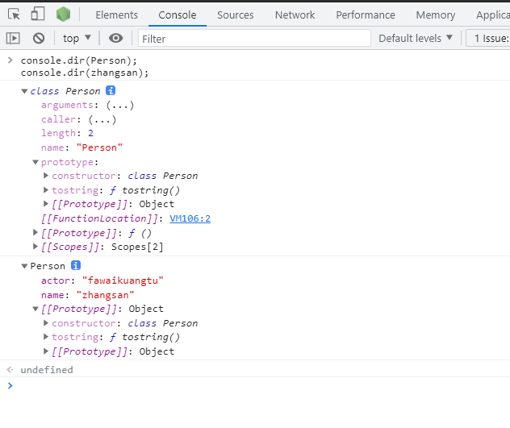

# 类

## 类的出现

由于前面花费了不少时间向大家介绍如何使用`ES5`的特性来模拟类似于类的行为，而实现继承的代码如此的冗长和混乱导致 `ES6` 新引入的 `class` 关键字具有正式定义类的能力。虽然表面看起来支持正式的面向对象编程，但是背后使用的仍然是原型和构造函数的概念。我们通常亲切的叫她 **语法糖**。

如果没有阅读相关的文章，推荐阅读 [JavaScript 中的继承](https://juejin.cn/post/6995777334951280653)

如果有类的相关基础概念，可以直接跳转到 [class 的继承](#class 的继承)

## 类定义

两种方式定义类：类声明和类表达式

```JavaScript
// 类声明
class Person { }

// 类表达式
const Animal = class {};
```

其实与函数表达式很类似，在它们被求值前都不能引用，唯一不同的是：

- 函数声明可以提升，但类定义不行
- 函数会受函数作用域限制，但类受块作用域限制

```JavaScript
console.log(FunctionExpression); // undefined
var FunctionExpression = function() {};
console.log(FunctionExpression); // function() {}
// 注意这里如果将 var 换成 let 或 const，将会报错，具体缘由请查看 JS 变量提升

console.log(FunctionDeclaration); // FunctionDeclaration() {}
function FunctionDeclaration() {}
console.log(FunctionDeclaration); // FunctionDeclaration() {}

console.log(ClassExpression); // undefined
var ClassExpression = class {};
console.log(ClassExpression); // class {}

console.log(ClassDeclaration); // ReferenceError: ClassDeclaration is not defined
class ClassDeclaration {}
console.log(ClassDeclaration); // class ClassDeclaration {}
```

## 类的简介

### 模拟类的世界 

上面的怕是看着很枯燥把，我们来看下面一个例子，在`es6`之前，我们生成实例对象是通过什么方式呢？没错！构造函数。

```javascript
function Person(name, actor) {
  this.name = name;
  this.actor = actor;
}

Person.prototype.tostring = function () {
  return `${this.name},${this.actor}`;
};

const zhangsan = new Person('张三', '法外狂徒');;
```

上面的也就是我们上一章说的构造函数生成实例的方式。那么在 `es6` ，引入了 `class` 这个概念，我们再看用  `class` 实现上述相同的代码。

```javascript
class Person {
  constructor (name, actor) {
    this.name = name;
    this.actor = actor;
  }

  tostring () {
    return `${this.name},${this.actor}`;
  }
}

const zhangsan = new Person('张三', '法外狂徒');;
```

### 查看类的内心世界

然后我们来查看一下 Person 类的内部结构以及实例化出来的 `张三` 具体拥有什么样的内心世界。

```javascript
console.dir(Person);
console.dir(zhangsan);
```



### 剖析类的内心世界

首先我们可以使用 `typeof` 方法来看一下 `Person`  的类型，发现是 `function`,  说明类的数据类型就是函数，然后类本身指向构造函数，然后 `Person` 上依然会有 `prototype` 属性，我们会看到之前定义的 `tostring()` 方法也在类的原型上。

```javascript
typeof Person; // "function"

Person.prototype.constructor === Person; // true

zhangsan.__proto__ === Person.prototype; // true
zhangsan.constructor === Person; // true

// 这里实际上调用的是类的原型上定义的 tostring() 方法
zhangsan.tostring(); // "张三,法外狂徒"
```

### 得出结论

> 鲁迅：其实这世上本没有路，走的人多了，那便成了路。

其实 `类` 只不过是一种语法糖，为什么会出现类？借迅哥的一句话，其实就是使用的人多了，渐渐的就出现了 `类`，你可以把所有程序员想象成 `产品经理` 兼 `技术开发`，一边在疯狂的 coding 自己封装的原型方法，一边在感叹为什么 `JavaScript` 没有像 `Java` 语言 `类` 的概念，然后有着同样项目设计理念的程序员们就会去参与开源的 `JavaScript` 技术讨论，渐渐的针对所有人提出的观点以及代码的贡献，最终形成了新的概念 `类`，没错，它也是基于 `es5` 之前的版本，只不过是官方给了她一个名称而已。 

### 不同点

```JavaScript
function Person(name, actor) {
  this.name = name;
  this.actor = actor;
}

Person.prototype.tostring = function () {
  return `${this.name},${this.actor}`;
};

Object.keys(Person.prototype); // ["tostring"]

class Person {
  constructor (name, actor) {
    this.name = name;
    this.actor = actor;
  }

  tostring () {
    return `${this.name},${this.actor}`;
  }
}

Object.keys(Person.prototype); // []
Object.getOwnPropertyNames(Person.prototype) // ["constructor", "tostring"]
```

可见 `class` 原型上的方法无法 **枚举**

### constructor 方法

`constructor()`方法是类的默认方法，通过`new`命令生成实例对象时，自动调用该方法。一个类必须有`constructor()`方法，如果没有显式定义，一个空的`constructor()`方法会被默认添加。

```javascript
class Person {
}

// 等同于
class Person {
  constructor() {}
}
```

`constructor()`方法默认返回实例对象（即`this`），当然我们也完全可以返回另外一个对象

```JavaScript
class Person {
  constructor() {
    return Object.create(null);
  }
}

new Person() instanceof Person; // false
```

## 类的实例

生成类的实例的写法，与 ES5 完全一样，也是使用`new`命令。如果忘记加上`new`，像函数那样调用`Class`，将会报错。

```JavaScript
class Person {
  constructor (name, actor) {
    this.name = name;
    this.actor = actor;
  }

  tostring () {
    return `${this.name},${this.actor}`;
  }
}

const zhangsan = new Person('张三', '法外狂徒');
const tiezhu = new Person('铁柱', '职业法师');

zhangsan.tostring(); // "张三,法外狂徒"
zhangsan.hasOwnProperty('name'); // true
zhangsan.hasOwnProperty('actor'); // true
zhangsan.hasOwnProperty('tostring'); // false
zhangsan.__proto__.hasOwnProperty('tostring'); // true

// zhangsan 和 tiezhu 都是 Person 的实例，它们的原型都是 Person.prototype
// 所以我们可以通过 __proto__ 为类添加方法，但不推荐这样做，会影响到所有实例
zhangsan.__proto__ === tiezhu.__proto__; // true
```

## 其他特性

### 类中支持 getter（取值函数） 和 setter（存值函数）

与 ES5 一样，在类的内部可以使用`get`和`set`关键字，对某个属性设置存值函数和取值函数，拦截该属性的存取行为。

```JavaScript
class Person {
  constructor() {
  }

  get name() {
    return '张三';
  }

  set name(value) {
    console.log('setter: ' + value);
  }
}

const zhangsan = new Person();

zhangsan.name = '张三';
// setter: 张三

zhangsan.name;
// '张三'
```

### 静态方法

如果在一个方法前，加上`static`关键字，就表示该方法不会被实例继承，而是直接通过类来调用，这就称为“静态方法”。

```JavaScript
class Person {
  static sayHello() {
    return 'hello';
  }
}

Person.sayHello(); // 'hello'

var zhangsan = new Person();
zhangsan.sayHello();
// TypeError: foo.classMethod is not a function
```

如果静态方法中包含 `this` 关键字，既然实例不能继承静态方法，那么这个 `this` 指向的其实就是当前类，而不是实例。

### 静态属性

ES6 明确规定，Class 内部只有静态方法，没有静态属性，但是我们可以定义在类的原型上

```JavaScript
class Person {
}

Person.name = '张三';
Person.name // 张三
```

### 实例属性的新写法（不推荐）

一般我们都是将实例属性写在`constructor()`方法里面的`this`上面

```javascript
class Person {
  constructor(name, actor) {
      this.name = name;
      this.actor = actor;
  }
}
```

但是还有一种写法就是放在类的最顶层，但是个人推荐上面的写法

```JavaScript
class Person {
  name = '张三';
  actor = '法外狂徒'
  constructor() {
  }
}
```

## class 的继承

### 类的实例化

在讲解 `class` 实现的继承前，我们来看一下类的实例化的一个过程

1. 首先会在内存中创建一个新对象
2. 然后再将这个新对象内部的 `__proto__` 属性 被 赋值 为构造函数的  `prototype` 属性
3. 构造函数内部的 this 被赋值为这个新对象 （此时 this 指向的是这个新对象）
4. 执行构造函数内的代码（给新对象添加属性）
5. 如果构造函数返回非空对象，则返回该对象；否则默认返回的就是刚创建的新对象

#### 继承基础

虽然使用的是新语法，但是只是一种`语法糖`，实际上背后还是使用的原型链

保持了向后兼容，可以继承任何拥有 `construct` 和 `原型` 的对象

```JavaScript
function Person(name, actor) {
  this.name = name;
  this.actor = actor;
}

// 继承构造函数
class ActivePerson extends Person {}
// -------------------------------------
class Person {
  constructor(name, actor) {
      this.name = name;
      this.actor = actor;
  }
}

// 继承类
class ActivePerson extends Person {}
```

### super 关键字

这个关键字只能在派生类中使用，且既可以当作 `函数` 使用，也可以当作 `对象` 使用

- 作为函数调用时，代表父类的构造函数，且 es6 要求，子类的构造函数必须执行一次 `super` 函数，且只能用在子类的构造函数中

```JavaScript
class A {}

class B extends A {
  constructor() {
    super(); // 如果这里不写 super()， 那么会报错
  }
}
```

这里虽然代表的是 A 的构造函数，但是返回的是 B 的实例，即 `super()` 内部的 `this` 指向的是 B 的实例，所以 `super()` 相当于  `A.prototype.constructor.call(this)`

```javascript
class A {
  constructor() {
    console.log(new.target.name);
  }
}

class B extends A {
  constructor() {
    super();
  }
}

new A() // A
new B() // B
```

`new.target`指向当前正在执行的函数,所以看出在 `super()` 执行的时候，它指向的是 B 的构造函数

```javascript
class A {}

class B extends A {
  m() {
    super(); // 报错
  }
}
```

上面的表明：当 `super()` 是当作函数来调用的时候，只能用在子类的构造函数中

- `super` 作为对象来使用时，如果是在普通方法中，指向父类的原型对象；如果是在静态方法中，指向的是父类

```JavaScript
class A {
  p() {
    return 2;
  }
}

class B extends A {
  constructor() {
    super();
    console.log(super.p()); // 2
  }
}

let b = new B();
```

这里 `super.p()` 是在普通方法中，指向 `A.prototype`。所以我们可以访问父类原型上的方法，但是父类实例上的属性和方法我们是无法访问的

```JavaScript
class A {}
A.prototype.x = 2;

class B extends A {
  constructor() {
    super();
    console.log(super.x) // 2
  }
}
```

在普通方法中使用 super：

```JavaScript
class A {
  constructor() {
    this.x = 1;
  }
  print() {
    console.log(this.x);
  }
}

class B extends A {
  constructor() {
    super();
    this.x = 2;
  }
  m() {
    super.print();
  }
}

let b = new B();
b.m() // 2
```

这里我们得解释一下：此时 `this` 指向的是谁 ？ 没错， 是 B！

所以当我们在调用 `b.m()` 方法的时候，`super.print()` 相当于是执行 `A.prototype.print()`，但是此时 `print()` 内部的 `this` 指向的是 子类B 的实例。

在静态方法中使用 `super`：

```JavaScript
class Parent {
  static myMethod(msg) {
    console.log('static', msg);
  }

  myMethod(msg) {
    console.log('instance', msg);
  }
}

class Child extends Parent {
  static myMethod(msg) {
    super.myMethod(msg);
  }

  myMethod(msg) {
    super.myMethod(msg);
  }
}

Child.myMethod(1); // static 1

const child = new Child();
child.myMethod(2); // instance 2
```

上面代码中，`super`在静态方法之中指向父类，在普通方法之中指向父类的原型对象。

### 类的  `prototype`  属性 和 `__proto__` 属性（重点）

我们在上一章讲过，每一个对象都有一个 `__proto__` 属性，指向对应的构造函数的 `prototype` 属性，而 `class` 作为构造函数的语法糖，同时有 `prototype` 属性和 `__proto__` 属性，所以同时存在两条继承链

①：子类的 `__proto__` 属性，表示构造函数的继承，总是指向父类

②：子类 `prototype` 属性的 `__proto__` 属性，表示方法的继承，总是指向父类的 `prototype` 属性

可能上述讲的有些宽泛，我们直接上 demo

```JavaScript
class A {
}

class B extends A {
}

B.__proto__ === A; // true
B.prototype.__proto__ === A.prototype; // true
```

为什么会是这样的呢？让我们一起来剖析一下类的继承是怎样实现的。

```JavaScript
class A {
}

class B {
}

// Object.setPrototypeOf 的实现
Object.setPrototypeOf = function (obj, proto) {
  obj.__proto__ = proto;
  return obj;
}

// B 的实例继承 A 的实例
Object.setPrototypeOf(B.prototype, A.prototype);
// 等同于
B.prototype.__proto__ = A.prototype;

// B 继承 A 的静态属性
Object.setPrototypeOf(B, A);
// 等同于
B.__proto__ = A;

const b = new B();
```

作为一个对象，子类 B 的原型 (`__proto__` 属性) 是父类 A；

作为一个构造函数，子类 B 的原型对象(`prototype` 属性) 是父类的原型对象的实例

```JavaScript
B.prototype = Object.create(A.prototype);
// 等同于
B.prototype.__proto__ = A.prototype;
```

### 实例的 `__proto__` 属性

子类实例的 `__proto__.__proto__` 属性指向的是父类实例的 `__proto__` 属性。

也即是：子类的原型的原型，是父类的原型

```javascript
class Person {
  constructor(name, actor) {
    this.name = name;
    this.actor = actor;
  }
}

class ActivePerson extends Person {
  constructor(name, actor, hobby) {
    super();
    this.hobby = hobby;
  }
}

const person1 = new Person('张三', '法外狂徒');
const activePerson1 = new ActivePerson('张三', '法外狂徒', '完美犯罪');

person1.__proto__ === activePerson1.__proto__; // false
activePerson1.__proto__.__proto__ === person1.__proto__; // true
```

## 允许原生构造函数定义子类

### 来看一个继承 `Array` 的例子

```JavaScript
class MyArray extends Array {
  constructor(...args) {
    super(...args);
  }
}

const arr = new MyArray();
arr[0] = 12;
arr.length; // 1

arr.length = 0;
arr[0]; // undefined
```

由此可知，我们可以很容易的在这里扩展原型上的方法或是重写原型上的方法，封装出自己需要的数据结构。

### 自定义 `Error`

```javascript
class ExtendableError extends Error {
  constructor(message) {
    super();
    this.message = message;
    this.stack = (new Error()).stack;
    this.name = this.constructor.name;
  }
}

class MyError extends ExtendableError {
  constructor(m) {
    super(m);
  }
}

const myerror = new MyError('ll');
myerror.message // "ll"
myerror instanceof Error // true
myerror.name // "MyError"
myerror.stack
```

## 分析 `class` 继承

### 先来看寄生组合式继承

```JavaScript
function inherits(Child, Parent) {
    var F = function () {};
    F.prototype = Parent.prototype;
    Child.prototype = new F();
    Child.prototype.constructor = Child;
}

function Student(props) {
    this.name = props.name || 'Unnamed';
}

Student.prototype.hello = function () {
    alert('Hello, ' + this.name + '!');
}

function PrimaryStudent(props) {
    Student.call(this, props);
    this.grade = props.grade || 1;
}

// 实现原型继承链:
inherits(PrimaryStudent, Student);

// 绑定其他方法到PrimaryStudent原型:
PrimaryStudent.prototype.getGrade = function () {
    return this.grade;
};
```

这里调用 `inherits` 函数时，就是对父类的原型进行了一个备份，然后将父类原型的实例赋值给子类原型，再重写子类的构造函数指回自己，实现原型方法上的继承，使用构造函数继承实现父类属性的继承。

### 再看 `class` 实现的继承

```JavaScript
class Student {
  constructor(props) {
    this.name = props.name || 'Unnamed';
  }

  hello () {
    alert('Hello, ' + this.name + '!');
  }
}

class PrimaryStudent extends Student {
  constructor(props) {
    super(props);
    this.grade = props.grade || 1;
  }

  getGrade () {
    return this.grade;
  }
}
```

[使用 babel 在线转换工具，将 es6 的语法转换成 es5 的语法](https://babeljs.io/repl#?browsers=&build=&builtIns=false&corejs=3.6&spec=false&loose=false&code_lz=MYGwhgzhAEDKAuBXAJgUwHb2gbwFDWmAHt0J4AnRYeI8gCgAdyiGIBKHfA6eACwEsIAOnRgAtqmgBeaExbDRE6AB9l0AOQBVdItTJ1Abi4BfXF16oQIItDoc83aGBCpy8OuoASl6wBoN0ADUPAIK4pLB6gCE6mxGBKamuKCQMAAK5PxiYOQAnggoGFioAB7wGMgwBWiYnATEpBRUNPRyrPZcBBCIDK6MzO3x3HyCQgDm5GBo0rIDwhNTkqrQAIxDSQRjqPAA4pPTdnXc5NuI5Oghowto67jGQA&debug=false&forceAllTransforms=false&shippedProposals=false&circleciRepo=&evaluate=true&fileSize=false&timeTravel=false&sourceType=module&lineWrap=false&presets=es2015%2Cstage-3&prettier=false&targets=&version=7.15.3&externalPlugins=&assumptions=%7B%7D)

然后查看转换后的结果，这里只抽出重要的部分：

```JavaScript
"use strict";

function _inherits(subClass, superClass) { if (typeof superClass !== "function" && superClass !== null) { throw new TypeError("Super expression must either be null or a function"); } subClass.prototype = Object.create(superClass && superClass.prototype, { constructor: { value: subClass, writable: true, configurable: true } }); if (superClass) _setPrototypeOf(subClass, superClass); }

function _setPrototypeOf(o, p) { _setPrototypeOf = Object.setPrototypeOf || function _setPrototypeOf(o, p) { o.__proto__ = p; return o; }; return _setPrototypeOf(o, p); }

function _createSuper(Derived) { var hasNativeReflectConstruct = _isNativeReflectConstruct(); return function _createSuperInternal() { var Super = _getPrototypeOf(Derived), result; if (hasNativeReflectConstruct) { var NewTarget = _getPrototypeOf(this).constructor; result = Reflect.construct(Super, arguments, NewTarget); } else { result = Super.apply(this, arguments); } return _possibleConstructorReturn(this, result); }; }

var Student = /*#__PURE__*/function () {
  function Student(props) {
    _classCallCheck(this, Student);

    this.name = props.name || 'Unnamed';
  }

  _createClass(Student, [{
    key: "hello",
    value: function hello() {
      alert('Hello, ' + this.name + '!');
    }
  }]);

  return Student;
}();

var PrimaryStudent = /*#__PURE__*/function (_Student) {
  _inherits(PrimaryStudent, _Student);

  var _super = _createSuper(PrimaryStudent);

  function PrimaryStudent(props) {
    var _this;

    _classCallCheck(this, PrimaryStudent);

    _this = _super.call(this, props);
    _this.grade = props.grade || 1;
    return _this;
  }

  _createClass(PrimaryStudent, [{
    key: "getGrade",
    value: function getGrade() {
      return this.grade;
    }
  }]);

  return PrimaryStudent;
}(Student);
```

我们主要查看 `_inherits(PrimaryStudent, _Student)` 方法 和 `_super.call(this, props)` 方法，首先 `_inherits()` 方法和 `es5` 的写法差不多，但是最后多了一步 `_setPrototypeOf` 的操作，然后去查看 `_setPrototypeOf` 方法，看到它将 ` o.__proto__ = p`，也就是将子类的隐式原型指向了父类，那么为什么要这么做呢？没错！就是为了继承父类上的静态方法，要知道，我们在实现寄生组合式继承的时候，可以继承父类的属性和原型上的方法，但是却没有讲到静态方法这个概念，虽然我也没有过多使用过静态方法，意思应该是直接定义在构造函数上的方法且可以直接在构造函数上使用但不可在实例上使用（个人没有用到这种功能）。

然后再看 `_super.call(this, props)` 方法，其实就是 `Super.apply(this, arguments)`，这个和 es5 其实是一致的。

所以，我们可以使用 `Object.getPrototypeOf()` 方法从子类上获取父类；可以使用这个方法判断，一个类是否继承了另一个类。

```javascript
Object.getPrototypeOf(PrimaryStudent) === Student; // true
```

## 参考资料

- 《JavaScript高级程序设计》
- [ECMAScript 6 入门 之  class 篇](https://es6.ruanyifeng.com/#docs/class)

