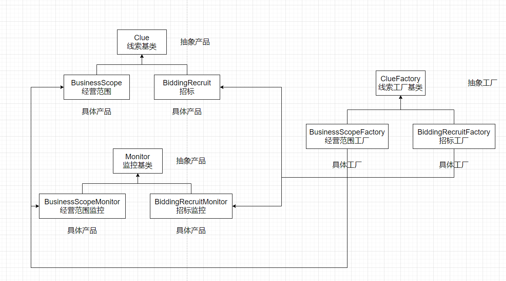

# 分享专题

## 什么是设计模式

代表了最佳的实践，通常被有经验的面向对象的软件开发人员所采用

是软件开发中一般问题的解决方案

## 设计模式解决了什么

1. 代码重用
2. 代码可理解
3. 代码可靠性

## 设计模式的四个基本要素

- **模式名称**：每一个模式都有自己的名字，模式的名字使得我们可以方便讨论我们的设计
- **问题**：在面向对象的系统设计过程中反复出现的特定场合，它导致我们使用某个模式
- **解决方案**：上述问题的解决方案，其内容给出了设计的各个组成部分，它们之间的关系、职责划分以及协作方式
- **效果**：采用该模式对软件系统其他部分的影响，比如系统的扩展性，可移植性的影响（也包括一些负面影响）——利弊权衡

## 设计模式的七大原则

- S —— Single Responsibility Principle 单一职责原则
  - 很好理解：一个程序只负责做好一件事
  - 如果一个方法过于复杂，那么是肯定可以拆分的
- O —— OpenClosed Principle 开放/封闭原则
  - 对扩展开放，对修改封闭
  - 即可扩展，不可修改；增加需求时是添加新代码，而不是修改已有代码
- L —— Liskov Substitution Principle 里氏替换原则
  - 一个对象在其出现的任何地方，都可以用子类实例做替换
  - 父类能出现的地方子类就能出现，子类能覆盖父类
- I —— Interface Segregation Principle 接口隔离原则
  - 保持接口的单一独立
  - 客户端程序不应该依赖它不需要的接口方法
- D —— Dependency Inversion Principle 依赖倒置原则
  - 抽象不应该依赖于细节，细节应当依赖于抽象
  - 针对抽象编程，而不是针对实现的细节编程
- CARP —— Composite/Aggregate Reuse Principle 合成/聚合复用原则
  - 尽量使用合成/聚合，而不是通过继承达到复用的目的
- LOD（LKP） —— Law Of Demeter 迪米特法则（Least Knowledge Principle 最少知识原则）
  - 一个软件实体应该尽可能少的与其他实体发生相互作用

## 分享内容

- ### 简单工厂模式 （Simple Factory）
- ### 工厂方法模式 （Factory Method）
- ### 抽象工厂模式 （Abstract Factory）

## 简单工厂

### 概念

也叫静态工厂方法，由一个工厂对象决定创建某一种产品的实例，主要用来创建同一类对象（这些产品可能都是继承同一个父类）

### 举例

企业认证——不同等级的企业认证（普通、高级、超级）

```javascript
class Certification {
    enjoy () {
        throw new Error('抽象基类无法直接调用！')
    }
}

class NormalCertification extends Certification {
    constructor(code) {
        this.code = code
        this.name = '普通认证'
    }

    enjoy () {
        return `you are enjoying a ${this.code} certification's rights!`
    }
}

class AdvancedCertification extends Certification {
    constructor(code) {
        this.code = code
        this.name = '高级认证'
    }
    
    enjoy () {
        return `you are enjoying an ${this.code} certification's rights!`
    }
}

class SuperCertification extends Certification {
    constructor(code) {
        this.code = code
        this.name = '超级认证'
    }

    enjoy () {
        return `you are enjoying a ${this.code} certification's rights!`
    }
}

const CertificationFactory = code => {
    switch (code) {
        case 'normal':
            return new NormalCertification(code);
        case 'advanced':
            return new AdvancedCertification(code);
        case 'super':
            return new SuperCertification(code);
        default:
            return new NormalCertification(code);
    }
}

const newCertification = CertificationFactory('advanced'); // 通过传参确定实例化哪个产品
// 用户使用实例化出来的产品
newCertification.enjoy(); // "you are enjoying an ${this.code} certification's rights!"
```

### 讲解

这里我们有三个抽象产品，分别对应的是 `NormalCertification` 、 `AdvancedCertification` 、`SuperCertification`，当然我们可以针对每一种认证方式都提供给客户端，但是这样子的操作会增加 `api` 的数量，首先在客户端的眼中，他们知道用户选择的是何种认证方式，但是当他们调用接口的时候，他们需要更加的了解到接口上的细节，针对不同的认证方式需要让客户端主动区分并调用不同的接口来完成，所以这样的设计是不合理的，所以我们只需要向外暴露出一个接口，通过 `CertificationFactory`  工厂来处理，认证的细节交由工厂来完成

相当于你告诉 `CertificationFactory` ，我想要一个 **高级认证**，最后你只要给客户 **高级认证** 这个实例化出来的产品就可以了。在这个期间，你不需要关注这个 **高级认证** 产品是怎么创建出来的，而是交由  **CertificationFactory** 这个工厂来完成，屏蔽掉了创建对象的细节，但是最后创建出来的对象大体相同（同一种对象）

### 角色

- **Factory**：工厂（负责实例化对象——生产产品对象）
- **Abstract Product**：抽象产品（所有实例对象的父类——产品的泛型）
  1. 球（抽象产品）：乒乓球、足球、篮球（具体产品）
  2. 门（抽象产品）：木门、铁门、铝门
- **Specific Product**： 具体产品（创建的目标，用它来创建实例——产品对象）

### 产品图


### 优点

- 你只需要告诉**工厂**你需要**什么**（有点类似去商店买东西，售货员是工厂，你需要买的东西是工厂会实例化出来的对象——产品）
- 在工厂内部包含了新对象的创建逻辑以及判断逻辑，无需关注具体的创建细节

### 缺点

- 由于创建逻辑以及判断逻辑都在工厂内部完成，如果新增认证类型就需要修改工厂方法
- 不满足开放/封闭原则，所以不在23种设计模式中
- 如果认证类型过多，工厂内部的逻辑将十分臃肿

## 工厂方法

### 概念

定义一个创建对象的接口，让其子类自己决定实例化哪一个工厂类，也就是将创建对象这个过程延迟到子类去做

### 举例

商机模板——针对不同的维度返回不同的模板（维度大概有十几种，客户端需要的是两句话）

首先如果采用简单工厂的模式，我们会遇到一个问题：维度在不断增加，我们将会不断修改工厂，不符合开闭原则

所以可以考虑采用工厂方法来进行设计，首先先定义我们的抽象产品和具体产品类

```JavaScript
// 抽象产品类
class Clue {
    recmdReasons () {
        throw new Error('抽象基类无法直接调用！')
    }
    businessClues () {
        throw new Error('抽象基类无法直接调用！')
    }
}

// 具体产品类
class BusinessScope extends Clue {
    constructor(business) {
        this.business = business
  	}

    recmdReasons () {
        const { fieldA, fieldB } = this.business
        return `该企业可能从事 ${fieldA} 下游的 ${fieldB} 业务`
    }

    businessClues () {
        const { fieldA } = this.business
        return `经营范围涵盖：${fieldA}`
    }
}

// 具体产品类
class BiddingRecruit extends Clue {
      constructor(business) {
        this.business = business
      }

      recmdReasons () {
        const { fieldA } = this.business
        return `该单位可能需要采购 ${fieldA}`
      }

      businessClues () {
        const { fieldA, fieldB, fieldC } = this.business
        return `${fieldA}，发布一则${fieldB}相关的招标公告：${fieldC}`
      }
}
```

上面是抽象类和产品类以及定义在产品类原型上的方法，上面有 **获取推荐理由** 和 **获取商机线索** 方法

然后我们来完成一下抽象工厂——线索维度工厂，

```JavaScript
class ClueFactory {
    constructor (clueName) {
        // new.target 指向直接被 new 执行的构造函数
        if (new.target === ClueFactory) {
            throw new Error('抽象基类无法实例化！')
        }
        this.clueName = clueName;
    }

    // 生产产品———线索维度
    getClueProduct () {
        throw new Error('派生类需要继承该方法，抽象函数无法直接调用！');
    }
}
```

上面是我们定义的一个抽象基类，主要是生产 **线索维度** 这个产品，但是父类是不做实例化这个操作的，下放给子类去做

```javascript
// 经营范围 工厂
class BusinessScopeFactory extends ClueFactory {
  constructor(clueName, business) {
    // 继承父类的属性
    super(clueName)
    // 组成商机模板需要的字段存放在 business 字段中
    this.business = business
  }

  getClueProduct () {
  	return new BusinessScope(this.business)
  }
}

// 招标 工厂
class BiddingRecruitFactory extends ClueFactory {
  constructor(clueName, business) {
    // 继承父类的属性
    super(clueName)
    // 组成商机模板需要的字段存放在 business 字段中
    this.business = business
  }

  getClueProduct () {
  	return new BiddingRecruit(this.business)
  }
}

// ........ 还有许多线索维度工厂

// 具体经营范围工厂实例
const businessScope = new BusinessScopeFactory('businessScope', {fieldA: 'fieldA', fieldB: 'fieldB', fieldC: 'fieldC'})
// 工厂生产出来的具体产品
const businessScopeSpecificProduct = businessScope.getClueProduct()
// 调用具体产品原型上的方法
businessScopeSpecificProduct.recmdReasons() // "该企业可能从事 fieldA 下游的 fieldB 业务"
businessScopeSpecificProduct.businessClues() // "经营范围涵盖：fieldA"

// 具体招标工厂实例
const biddingRecruit = new BiddingRecruitFactory('biddingRecruit', {fieldA: 'fieldA', fieldB: 'fieldB', fieldC: 'fieldC'})
// 工厂生产出来的具体产品
const biddingRecruitSpecificProduct = biddingRecruit.getClueProduct()
// 调用具体产品原型上的方法
biddingRecruitSpecificProduct.recmdReasons() // "该单位可能需要采购 fieldA"
biddingRecruitSpecificProduct.businessClues() // "fieldA，发布一则fieldB相关的招标公告：fieldC"
```

### 讲解

这里如果后续需要新加维度，我们只需要在两处地方新增代码，符合开闭原则，对扩展开放，对修改关闭

工厂方法模式：实际将创建对象的工作推迟到子类中去完成，这样基类其实成了抽象类，用户只要通过参数告诉我们需要去哪个工厂类生产产品

### 角色

- **Abstract Product**：抽象产品
- **Specific Product**：具体产品
- **Abstract Factory**：抽象工厂
- **Specific Factory**：具体工厂

### 产品图


### 优点

- 如果想要创建一个对象，只要知道对应的工厂，然后知道你具体要什么就可以了
- 扩展性高，符合开闭原则
- 不需要管具体的实现，只关心暴露出来的方法

### 缺点

- 每次新增一个维度，都需要增加一个具体产品类和对应的工厂类

但是，在使用设计模式的时候，也需要根据实际情况而定，不可为了套用设计模式而脱离实际开发场景

## 抽象工厂

### 概念

抽象工厂其实是 **产品族** 和 **产品等级结构** 两个概念的结合

产品等级结构：产品的继承结构

产品族：由一个工厂生产的、位于不同产品等级结构中的一组产品

理解：首先理解产品等级结构，我们上面说是产品的继承结构，很简单，就拿抽象产品手机来举例，它的子类有小米手机、一加手机、苹果手机、锤子手机等等，这些子类之间构成了一个 **产品等级结构**； 然后小米工厂又不止会生产小米手机，还会生产一些小米充电器、小米音箱、小米电视机、小米手环等，同一个工厂生产出来的位于不同的产品等级结构的一组产品，我们称为 **产品族**


### 举例

我们来改造一下上面商机模板的例子（可以但没必要）

首先来定义一下线索维度的抽象工厂，提供两个抽象方法来获取推荐理由和商机线索

```JavaScript
class ClueFactory {
    constructor (clueName) {
        if (new.target === ClueFactory) {
            throw new Error('抽象基类无法实例化！')
        }
        this.clueName = clueName;
    }

    // 生产线索维度——产品
    getClueProduct () {
        throw new Error('派生类需要继承该方法，抽象函数无法直接调用！');
    }

    // 生产监控——产品
    getMonitor () {
        throw new Error('派生类需要继承该方法，抽象函数无法直接调用！');
    }
}
```

然后定义具体工厂

```JavaScript
// 经营范围 工厂
class BusinessScopeFactory extends ClueFactory {
  constructor(clueName, business) {
    super(clueName)
    this.business = business
  }

  getClueProduct () {
  	return new BusinessScope(this.business)
  }
    
  getMonitor () {
    return new BusinessScopeMonitor()
  }
}

// 招标 工厂
class BiddingRecruitFactory extends ClueFactory {
  constructor(clueName, business) {
    super(clueName)
    this.business = business
  }

  getClueProduct () {
  	return new BiddingRecruit(this.business)
  }

  getMonitor () {
    return new BiddingRecruitMonitor()
  }
}
```

接着定义抽象产品类 **Clue** 和具体产品类 **BusinessScope** 和 **BiddingRecruit** ，在具体产品类的原型上有  `recmdReasons` 和  `businessClues` 方法

```JavaScript
// 抽象基类
// 这里BusinessScope和BiddingRecruit构成的是 产品等级结构
class Clue {
	constructor (business) {
		this.business = business
	}

    recmdReasons () {
        throw new Error('不可以调用抽象基类！')
    }
    
    businessClues () {
        throw new Error('不可以调用抽象基类！')
    }
}

class BusinessScope extends Clue {
    constructor (business) {
        super(business)
    }

    recmdReasons () {
        const { fieldA, fieldB } = this.business
        return `该企业可能从事 ${fieldA} 下游的 ${fieldB} 业务`   
    }

    businessClues () {
        const { fieldA } = this.business
        return `经营范围涵盖：${fieldA}`
    }
}

class BiddingRecruit extends Clue {
    constructor (business) {
        super(business)
    }

    recmdReasons () {
      	const { fieldA } = this.business
        return `该单位可能需要采购 ${fieldA}`   
    }
    
    businessClues () {
        const { fieldA, fieldB, fieldC } = this.business
        return `${fieldA}，发布一则${fieldB}相关的招标公告：${fieldC}`  
    }
}
```

接着定义抽象产品类 **Monitor** 和具体产品类 **BusinessScopeMonitor** 和 **BiddingRecruitMonitor** ，在具体产品类的原型上有  `recommend` 方法

```javascript
// 监控
class Monitor {
    recommend () {
        throw new Error('不可以调用抽象基类！')
    }
}

class BusinessScopeMonitor extends Monitor {
    recommend () {
        return '经营范围监控'
    }
}

class BiddingRecruitMonitor extends Monitor {
    recommend () {
        return '招投标监控'
    }
}
```

然后抽象工厂类、具体工厂类、抽象产品类、具体产品类就都创建好了，接下我们来看下实例化的过程

```javascript
const businessScope = new BusinessScopeFactory('businessScope', {fieldA: 'fieldA', fieldB: 'fieldB', fieldC: 'fieldC', name: '海绵宝宝'})
// 实例化产品对象，线索维度——产品
const businessScopeSpecificProduct = businessScope.getClueProduct()
businessScopeSpecificProduct.recmdReasons() // "该企业可能从事 fieldA 下游的 fieldB 业务"
businessScopeSpecificProduct.businessClues() // "经营范围涵盖：fieldA"

// 实例化产品对象，监控——产品
const businessScopeMonitorSpecificProduct = businessScope.getMonitor()
businessScopeMonitorSpecificProduct.recommend() // "经营范围监控"


const biddingRecruit = new BiddingRecruitFactory('biddingRecruit', {fieldA: 'fieldA', fieldB: 'fieldB', fieldC: 'fieldC', name: '派大星'})
// 实例化产品对象，线索维度——产品
const biddingRecruitSpecificProduct = biddingRecruit.getClueProduct()
biddingRecruitSpecificProduct.recmdReasons() // "该单位可能需要采购 fieldA"
biddingRecruitSpecificProduct.businessClues() // "fieldA，发布一则fieldB相关的招标公告：fieldC"

// 实例化产品对象，玩具——产品
const biddingRecruitMonitorSpecificProduct = biddingRecruit.getMonitor()
biddingRecruitMonitorSpecificProduct.recommend() // "招投标监控"
```

其实一般很少遇到这种产品族的情况，下面为抽象工厂的示意图

### 角色

- **Abstract Product**：抽象产品
- **Specific Product**：具体产品
- **Abstract Factory**：抽象工厂
- **Specific Factory**：具体工厂

### 产品图



抽象工厂模式主要提供一个创建一系列相关或相互依赖对象的接口，而无需指定它们具体的类

### 优点

- 当一个产品族中多个对象被设计为一起工作的时候，它可以保证我们始终使用同一个产品族中的对象

### 缺点

- 产品族不容易扩展，如果要增加某一个产品，那么具体工厂和抽象工厂都需要添加代码

