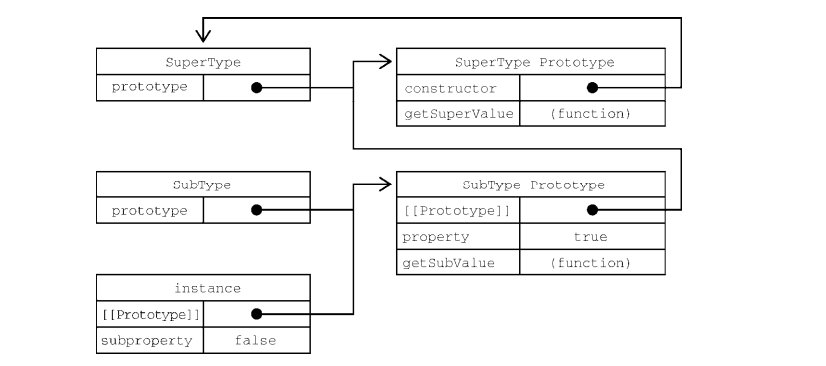
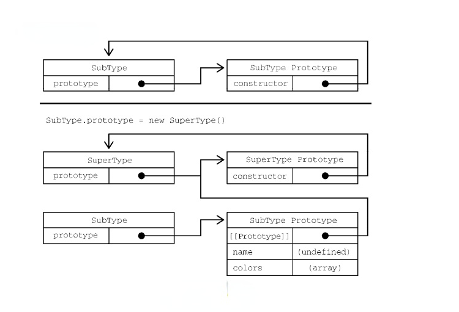

# JavaScript 中的继承

## 理清构造函数、原型和实例之间的关系

每个构造函数都有一个原型对象，原型有一个属性指回构造函数，而实例有一个内部指针指向原型

```javascript
function Developer () {}
const xiaoming = new Developer() 
const xiaobai = new Developer()
```


上图其实已经表明了三者之间的关系

```javascript
xiaoming.__proto__ === Developer.prototype
xiaobai.__proto__ === Developer.prototype
xiaoming.__proto__.__proto__ === Object.prototype
Developer.prototype.__proto__ === Object.prototype // 同上
xiaoming.__proto__.__proto__.__proto__ === null
Developer.prototype.__proto__.__proto__ === null // 同上
Developer.prototype.constructor === Developer
```

## 讲述神奇的 `prototype` 和 `__proto__`

这里得先讲述一下 `prototype（显式原型）` 和 `__proto__（隐式原型）` 之间的关系

`prototype`：每一个函数在创建之后都会拥有一个名为`prototype`的属性，这个属性指向函数的原型对象

`__proto__`：不同的浏览器可能命名的方式不同，别名为 `[[prototype]]`，下面都会使用 `__proto__` 表示，这个是内置属性，任意对象都会有一个`__proto__`属性，`Object.prototype`这个对象是个例外，它的 `__proto__` 是 `null`

讲述完两者的定义后，她们俩之间究竟有什么联系呢，让大家经常对其哭笑不得，一方面感叹 `JavaScript` 带给大家的福报，一方面又觉得 `JavaScript`内部的实现过于复杂，这就是动态语言的鸡肋叭

定义：隐式原型指向**创建**这个对象的函数(constructor)的prototype

什么意思呢？举个栗子好了，比如上面 `xiaoming` 这个对象，它是由 `Developer`这个构造函数创建的，`Developer.prototype.constructor`又指向了 `Developer`，所以最后就有了 `xiaoming.__proto__ === Developer.prototype`

两者之间的作用：既然定义成了两个不一样的属性，那肯定是起着不一样的作用。

- 显式原型的作用：用来实现基于原型的继承与属性的共享
- 隐式原型的作用：构成原型链，同样用于实现基于原型的继承

## 原型链

### 先来一个小demo

在`es6`之前，并没有 `class` 关键字的知识，那之前伟大的程序员们又是怎么实现继承的呢？别慌，我们一点点的揭开它神秘的面纱

```javascript
function SuperType() {
  this.property = true;
}

SuperType.prototype.getSuperValue = function () {
  return this.property;
};

function SubType() {
  this.subproperty = false;
}

// 继承 SuperType
SubType.prototype = new SuperType();

SubType.prototype.getSubValue = function () {
  return this.subproperty;
};

const instance = new SubType();
console.log("instance.getSuperValue() :>> ", instance.getSuperValue()); // true
```

上面的代码中定义了两个类型：`SuperType` 和 `SubType`，它们分别定义了一个属性，分别在原型上添加了一个方法，但是我们发现主要的区别就是  `SubType` 通过创建 `SuperType` 的实例并将其赋值给自己的原型 `SubType`，这时 prototype 实现了对 `SuperType` 的继承，这说明了啥？所有 `SuperType` 实例可以访问的所有属性和方法通过`SubType.prototype`也可以访问，然后在 `SubType.prototype` 上又定义了新的方法，也就是 `SuperType`的实例上添加了 `getSubValue`方法，最后创建了 `SubType`  的实例且调用了它继承的 `getSuperValue` 方法。

### 分析原型链



 上图很好的解释了什么是原型链，当然这只是原型链中的一部分。我们发现 `SubType.prototype`现在是 `SuperType`的一个实例，所以 `property` 会存储在 `SubType.prototype`上，但是由于 `SubType.prototype`的 `constructor`属性被重写为指向 `SuperType`，所以 `instance.constructor`也指向 `SuperType`

然后我们来解释一下 `instance.getSuperValue()`经历了什么。首先我们会在实例上搜索这个属性，如果没有找到，则会继承搜索实例的原型。在通过原型链实现继承后搜索可以继承向上，搜索原型的原型。所以它依次找到了 `instance`、`SubType.prototype`、`SuperType.prototype`。 也就是 `instance`、`instance.__proto__`、`instance.__proto__.__proto__`。

### 完整的原型链

我们在讲述上图的时候，有提过这只是原型链的一部分，是因为再往上还有 `Object`,下面才是完整的原型链


在调用 `instance.toString()`时，由于 `toString()`方法在 `Object.prototype`上才会有，所有实际上调用的是 `Object.prototype`上的方法

### 原型链上的方法

子类有时候需要定义新的方法或是覆盖父类的方法，所以在实现原型赋值之后需要再添加到原型上

```JavaScript
function SuperType() {
  this.property = true;
}

SuperType.prototype.getSuperValue = function () {
  return this.property;
};

function SubType() {
  this.subproperty = false;
}

// 继承 SuperType
SubType.prototype = new SuperType();

// 定义在原型上的新方法
SubType.prototype.getSubValue = function () {
  return this.subproperty;
};

// 定义在原型上的方法（覆盖父类的方法）
SubType.prototype.getSuperValue = function () {
  return false;
};

const instance = new SubType();
console.log("instance.getSuperValue() :>> ", instance.getSuperValue()); // false
```

**注意**：不可以以对象字面量的方式创建原型方法，因为这相当于重写了原型链

```JavaScript
SubType.prototype = {
  getSubValue() {
    return this.subproperty;
  },
  getSuperValue() {
    return false;
  },
};
// 这种方式相当于对 SubType.prototype 的重新赋值，相当于断开了之前的指针，然后新创建了一个对象A，然后将指针指向了新对象A
```

### 原型链的问题

- 原型中包含的引用值会在所有实例间共享
- 原型实际上变成了另一个类型的实例
- 子类型在实例化时不能给父类型的构造函数传参

```JavaScript
function SuperType() {
  this.colors = ["red", "blue", "green"];
}

function SubType() {}

// 继承 SuperType
SubType.prototype = new SuperType();

const instance1 = new SubType();
instance1.colors.push("black");
console.log(instance1.colors); // "red,blue,green,black"

const instance2 = new SubType();
console.log(instance2.colors); // "red,blue,green,black"
```

上面我们希望的是每个`SuperType`的实例都会有自己的 `colors` 属性，但是 `SubType.prototype` 成了 `SuperType` 的一个实例，也就相当于在 `SubType.prototype` 上创建了一个 `colors` 属性，所有 `SubType` 的实例都会共享这个 `colors` 属性。

## 盗用构造函数

### 基本思路

在子类构造函数中调用父类的构造函数（解决原型包含引用值导致的继承问题）

```JavaScript
function SuperType() {
  this.colors = [ 'red', 'blue', 'green' ];
}

function SubType() {
  // 继承 SuperType
  SuperType.call(this);
}

const instance1 = new SubType();
instance1.colors.push('black');
console.log(instance1.colors); // "red,blue,green,black"

const instance2 = new SubType();
console.log(instance2.colors); // "red,blue,green"
```

这里使用 `call()` 或者 `apply()` 方法，相当于新的 `SubType` 对象运行了 `SuperType()` 函数中所有的初始化代码，然后每个实例都会有自己的 `color` 属性

### 优点

- 相比于使用原型链，盗用构造函数可以在子类构造函数中向父类构造函数传参

### 缺点

- 子类不能访问父类原型上的方法
- 必须在构造函数中定义方法，函数无法重用

```JavaScript
function SuperType(name) {
  this.name = name;
}

function SubType() {
  // 继承 SuperType 并传参
  SuperType.call(this, 'Nicholas');
  // 实例属性
  this.age = 29;
}

const instance = new SubType();
console.log(instance.name); // "Nicholas";
console.log(instance.age); // 29
```

## 组合继承

### 基本思路

综合了原型链和盗用构造函数，集合两者的优点。使用原型链继承原型上的属性和方法，使用盗用构造函数继承实例属性。

```JavaScript
function SuperType(name) {
  this.name = name;
  this.colors = [ 'red', 'blue', 'green' ];
}

SuperType.prototype.sayName = function() {
  console.log(this.name);
};

function SubType(name, age) {
  // 继承属性
  SuperType.call(this, name);
  this.age = age;
}

// 继承方法
SubType.prototype = new SuperType();

SubType.prototype.sayAge = function() {
  console.log(this.age);
};

const instance1 = new SubType('Nicholas', 29);
instance1.colors.push('black');
console.log(instance1.colors); // "red,blue,green,black"
instance1.sayName(); // "Nicholas";
instance1.sayAge(); // 29

const instance2 = new SubType('Greg', 27);
console.log(instance2.colors); // "red,blue,green"
instance2.sayName(); // "Greg
```

### 分析

组合继承弥补了原型链和盗用构造函数的不足，是 `Javascript` 中使用最多的继承模式，且组合继承保留了 `instanceof` 操作符和  `isPrototypeOf()` 方法识别合成对象的能力

但还是有缺点的，让我们静心往下看，揭开最终完美的继承的神秘面纱

## 原型式继承

### 观点提出

2006年，Douglas Crockford 写了一篇文章：《JavaScript 中的原型式继承》，介绍了一种不涉及严格意义上构造函数的继承方法

```JavaScript
function object(o) {
 function F() {}
 F.prototype = o;
 return new F();
}
```

### 观点验证

```javascript
// 用于验证的伪代码
const f = new F(); 
// 于是有
f.__proto__ === F.prototype; // true
// 又因为
F.prototype === o; // true
// 所以
f.__proto__ === o;
```

### 原理分析

`object()`函数会创建一个临时构造函数，将传入的对象赋值给这个构造函数的原型，然后返回这个临时类型的一个实例。本质上，`Object()`其实是对传入的对象执行了一次浅复制

```JavaScript
const person = {
  name: 'xiaoming',
  friends: [ 'xiaobai', 'xiaohei', 'xiaomei' ]
};

const anotherPerson = object(person);
anotherPerson.name = 'xiaoqing';
anotherPerson.friends.push('xiaohong');

const yetAnotherPerson = object(person);
yetAnotherPerson.name = 'xiaolong';
yetAnotherPerson.friends.push('xiaohuang');

console.log('person.friends :>> ', person.friends); // ["xiaobai", "xiaohei", "xiaomei", "xiaohong", "xiaohuang"]
```

后续 ECMAScript 5 通过增加了 `Object.create()` 方法将原型式继承的概念规范化了，它接收两个参数：作为新对象原型的对象和给新对象定义额外属性的对象，其中第二个参数是可选的，在只有一个参数的时候，`Object.create()` 和 `object()` 方法效果相同

```javascript
const person = {
  name: 'xiaoming',
  friends: [ 'xiaobai', 'xiaohei', 'xiaomei' ]
};

const anotherPerson = Object.create(person);
anotherPerson.name = 'xiaoqing';
anotherPerson.friends.push('xiaohong');

const yetAnotherPerson = Object.create(person);
yetAnotherPerson.name = 'xiaolong';
yetAnotherPerson.friends.push('xiaohuang');

console.log('person.friends :>> ', person.friends); // ["xiaobai", "xiaohei", "xiaomei", "xiaohong", "xiaohuang"]
```

`Object.create()`的第二个参数：支持每个新增属性都通过各自的描述符来描述，当然它也会覆盖原型对象上的同名属性

```JavaScript
const person = {
  name: 'xiaoming',
  friends: [ 'xiaobai', 'xiaohei', 'xiaomei' ]
};

const anotherPerson = Object.create(person, {
  name: {
    value: 'xiaoqing'
  }
});

console.log('anotherPerson.name :>> ', anotherPerson.name); // xiaoqing
```

### 适用场景

原型式继承非常适合不需要单独创建构造函数，但仍然需要在对象间共享信息的场合，**但是**：属性中包含的引用值始终会在相关对象间共享，类似于原型模式

## 寄生式继承

### 原理分析

创建一个实现继承的函数，以某种方式增强对象，然后返回这个对象，基本的寄生继承模式如下

```JavaScript
function object(o) {
  function F() {}
  F.prototype = o;
  return new F();
}

function createAnother (original) {
  const clone = object(original); // 通过调用函数创建一个新对象
  clone.sayHi = function () { // 以某种方式增强这个对象
    console.log('hi');
  };
  return clone; // 返回这个对象
}
```

这里 `createAnother` 函数接收一个参数，就是新对象的基准对象，这个对象会传递给 `object()`函数，然后返回的新对象其实是一个构造函数 `F` 的实例，然后F的原型是 `original`，所以 `clone.__proto__ === original`，然后在 `clone` 这个实例对象上添加新的方法和属性，最后返回这个对象。

```JavaScript
const person = {
  name: 'xiaoming',
  friends: [ 'xiaobai', 'xiaohei', 'xiaomei' ]
};

const anotherPerson = createAnother(person);
anotherPerson.sayHi(); // hi
```

 上面 `anotherPerson` 对象具有 `person`的所有属性和方法，还有一个新方法 `sayHi()`

### 缺点

- 通过寄生式继承给对象添加函数会导致函数难以重用，与构造函数模式类似
- 仅提供一种思路，只不过式对一个目标对象进行浅复制，然后增强这个复制出来的对象的能力

## 寄生式组合继承

### 再谈组合继承

上面交代了组合继承虽然满足我们所有的需求，但是在性能上确是有问题的。也就是：

父类构造函数始终会被调用两次：第一次调用是在创建子类原型时添加了父类的属性，第二次调用是在给子类的构造函数添加了父类的属性

```JavaScript
function SuperType(name) {
  this.name = name;
  this.colors = [ 'red', 'blue', 'green' ];
}

SuperType.prototype.sayName = function() {
  console.log(this.name);
};

function SubType(name, age) {
  SuperType.call(this, name); // 第二次调用 SuperType()
  this.age = age;
}

SubType.prototype = new SuperType(); // 第一次调用 SuperType()
SubType.prototype.constructor = SubType;
SubType.prototype.sayAge = function() {
  console.log(this.age);
};
```

首先，在第一次调用 `SuperType` 的时候，`SubType.prototype`上就会有两个属性：`name`和 `colors`，它们都是 `SuperType` 的实例属性，但现在变成了 `SubType` 的原型属性，在调用 `SubType` 构造函数时，也会调用 `SuperType` 构造函数，然后会在新对象上创建实例属性 `name` 和 `colors`，这两个实例属性会屏蔽掉原型上同名的属性，具体流程如下。



`new SuperType()` 创建出来的实例被赋值给了 `SubType.prototype`，所以，`SubType.prototype.__proto__`其实指向的是 `SuperType.prototype`，且在 `SubType.prototype`原型上还有 `name` 和 `colors` 属性，这两个属性是由 `new SuperType()` 创建出来的实例对象的属性


同样，在用 `new SubType()`创建出来的  `SubType`实例也会有继承自 `SuperType`上的属性以及自己的属性

### 终极奥义——上代码

```JavaScript
function object(o) {
  function F() {}
  F.prototype = o;
  return new F();
}

function inheritPrototype (subType, superType) {
  const prototype = object(superType.prototype); // 创建对象
  prototype.constructor = subType; // 增强对象
  subType.prototype = prototype; // 赋值对象
}
```

`inheritPrototype()` 函数实现了寄生式组合继承的核心逻辑，接收两个参数：分别是 子类构造函数和父类构造函数。一开始看的时候也有点蒙，但是静下心来读前人封装的代码，真的是佩服的五体投地，既然组合继承会调用两次构造函数，且在子类实例的原型上会有多余的属性，那么我们为什么不可以直接取父类构造函数的原型为一个副本，然后针对需要继承父类的属性，采用构造函数继承的方式进行呢？

所以先创建一个实例对象 `prototype`，而这个创建这个实例对象的构造函数正是 `superType.prototype`，也就是父类构造函数的原型，然后再将 `constructor` 属性指回 `subType`解决重写原型导致默认 `constructor` 丢失的问题，这样下来 `subType.prototype` 上就没有多余的属性且不会调用父类的构造函数

### 下面我们来实践一下

```JavaScript
function SuperType(name) {
  this.name = name;
  this.colors = [ 'red', 'blue', 'green' ];
}

SuperType.prototype.sayName = function() {
  console.log(this.name);
};

function SubType(name, age) {
  SuperType.call(this, name);
  this.age = age;
}

inheritPrototype(SubType, SuperType);

SubType.prototype.sayAge = function() {
  console.log(this.age);
};
```

### 再来看下廖雪峰老师实现的继承

```JavaScript
// 廖雪峰老师实现版本
function inherits(Child, Parent) {
    var F = function () {};
    F.prototype = Parent.prototype;
    Child.prototype = new F();
    Child.prototype.constructor = Child;
}

// 官方实现的版本
function object(o) {
  function F() {}
  F.prototype = o;
  return new F();
}

function inheritPrototype (subType, superType) {
  const prototype = object(superType.prototype); // 创建对象
  prototype.constructor = subType; // 增强对象
  subType.prototype = prototype; // 赋值对象
}
```

是不是很熟悉？对的，其实就是将官方实现的版本糅合在了一起。

```JavaScript
function inherits(Child, Parent) {
    var F = function () {};
    F.prototype = Parent.prototype;
    Child.prototype = new F();
    Child.prototype.constructor = Child;
}

function Student(props) {
    this.name = props.name || 'Unnamed';
}

Student.prototype.hello = function () {
    alert('Hello, ' + this.name + '!');
}

function PrimaryStudent(props) {
    Student.call(this, props);
    this.grade = props.grade || 1;
}

// 实现原型继承链:
inherits(PrimaryStudent, Student);

// 绑定其他方法到PrimaryStudent原型:
PrimaryStudent.prototype.getGrade = function () {
    return this.grade;
};

const xiaoming = new PrimaryStudent({
    name: '小明',
    grade: 2
});
xiaoming.name; // '小明'
xiaoming.grade; // 2

// 验证原型:
xiaoming.__proto__ === PrimaryStudent.prototype; // true
xiaoming.__proto__.__proto__ === Student.prototype; // true

// 验证继承关系:
xiaoming instanceof PrimaryStudent; // true
xiaoming instanceof Student; // true
```

### 然后我们来看一下现有的原型链


只调用了一次父类的构造函数，避免了子类原型上用不到也没有必要继承的属性。由上面的例子可以看出，原型链仍然保持不变，所以 `instanceof`和 `isPrototypeOf` 方法正常有效。是引用类型继承的最佳模式

## 讲了这么多，我们要做什么

### 设计模式

我会针对于 js  的设计模式，写相关的文章，可能有些设计模式会涉及到原型和原型链以及他们的继承，你需要了解相关的知识

### js  库

了解原型、原型链、继承后方便我们阅读开源的 js 库，通常作者会在其原型上封装一些方法

### js 框架

我们在学会原型这一系列的知识后，能够主动去重新认识 react、vue等框架，了解其实现的部分功能涉及到的原型的相关知识点

## 参考资料

- [原型继承](https://www.liaoxuefeng.com/wiki/1022910821149312/1023021997355072)
- 《 Javascript 高级程序设计》