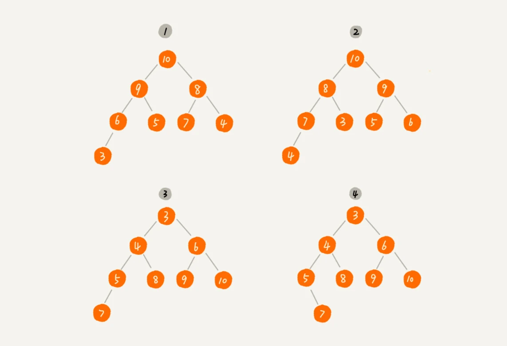
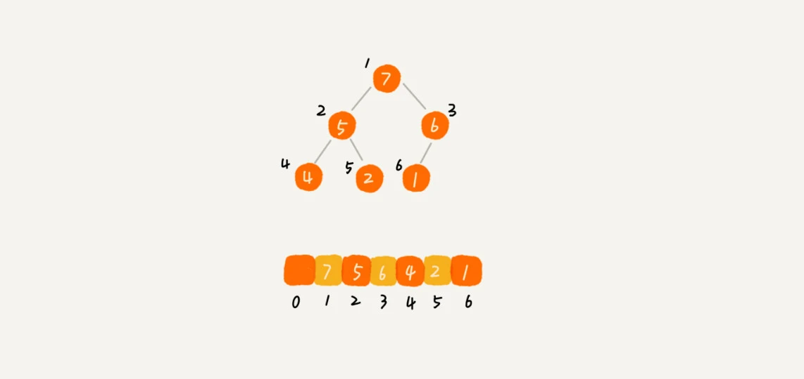
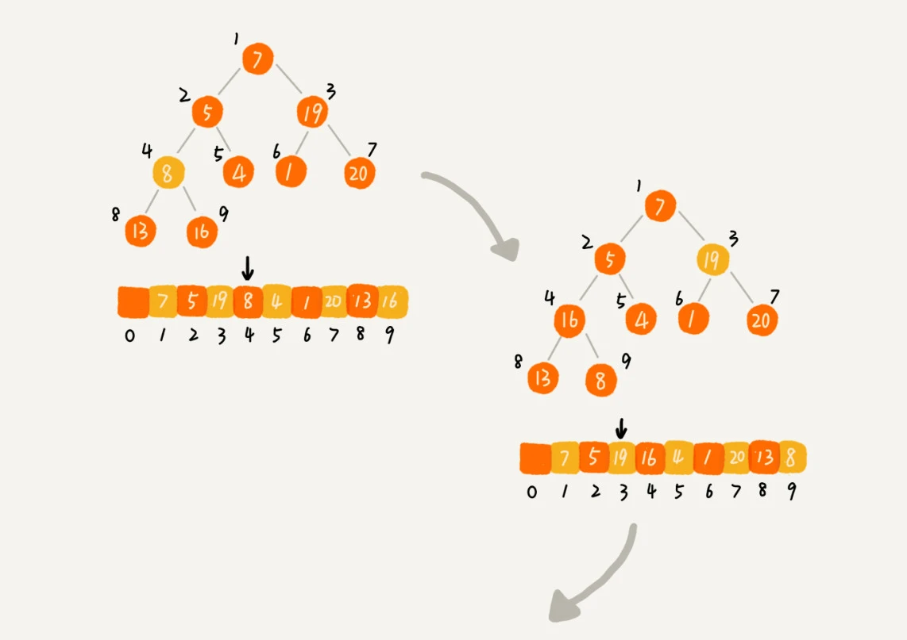
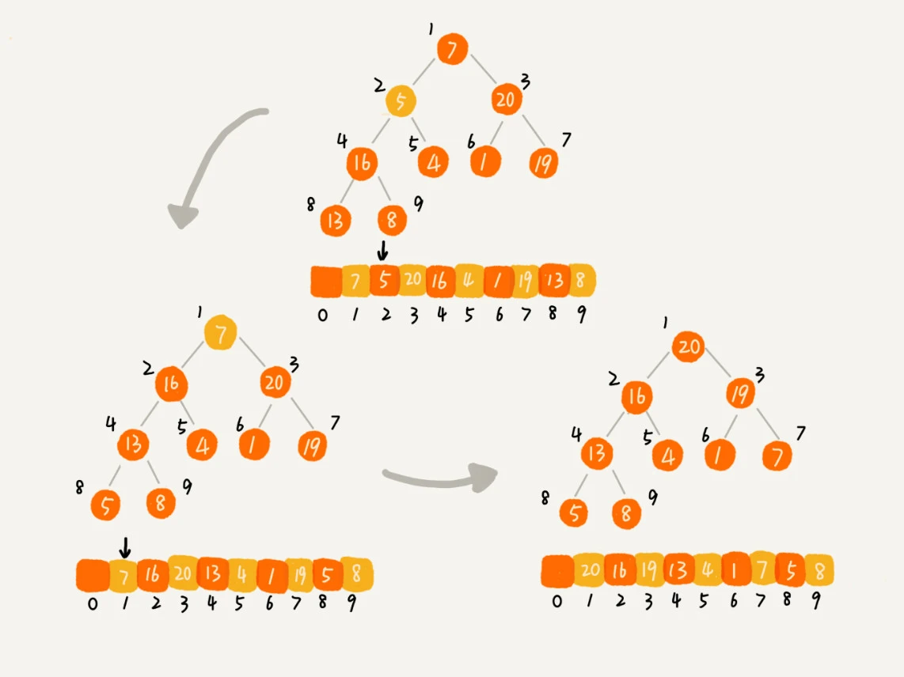

## 插入排序和堆排序算法总结

### 基础知识回顾

* **稳定**： 如果 a = b 且排序之前 a 在 b 的前面，排序后 a 仍然在 b 的前面
* **不稳定**： 如果 a = b 且排序之前 a 在 b 的前面，排序后 a `可能`出现在 b 的后面

### 插入排序 （Insertion Sort）

* #### **基本思想**

  首先，我们将数组中的数据分为两个区间，**已排序区间** 和  **未排序区间**，初始已排序区间就是数组的第一个元素，然后取未排序区间中的元素，在已排序区间中找到合适的插入位置将元素插入，并保证已排序区间数据一直有序。重复这个过程，直到未排序区间的元素为空，算法结束

* #### **动图展示**

  

  

  从上面的动图中，我们很容易能够看出来插入排序的思想，有点类似于你抓了一把扑克，然后依次将元素插入到它应该在的位置，假定第一个数已经排好了序，那么现在将第二个数插入到前面的有序区间中，那么现在的两个数就是有序的；如果前面 n - 1 个数已经排序了序，那么将最后第 n 个数插入到前面 n - 1 个已排序区间，使这 n 个数变成已排序区间

* #### **代码实现**

  ```javascript
  /**
   * 插入排序思想
   * 步骤一：找到元素应该插入的位置，然后插入
   * 步骤二：对应比当前元素大的进行右移
   * @param {*} arr
   */
  const insertSort = arr => {
    const len = arr.length;
    for (let i = 1; i < len; i++) {
      let preIndex = i - 1;
      let current = arr[i];
      while (preIndex >= 0 && arr[preIndex] > current) {
        arr[preIndex + 1] = arr[preIndex];
        preIndex--;
      }
      arr[preIndex + 1] = current;
    }
    return arr;
  };
  ```

* #### **代码解读**

  首先我们需要记录的是数组的长度 len，然后就是外层的 for 循环，为什么 i 是从 1 开始的，是因为我们默认第 0 个元素就是已排好序的，所以只需要从第二个元素开始和已排序区间进行比较，然后再考虑要不要写 `i <= len` ？答案是不需要的，为什么呢？

  因为我们这里 i 代表的是循环整个数组，那么如果你想要取到数组的最后一个元素，当然是 `len - 1`，所以取不到 `len`，这是一个需要注意的点。然后我们在循环里面，定义了两个变量，一个是 `preIndex`，表示当前循环的元素的前一个元素的索引，另一个是 `current`，表示当前循环的元素。

  **preIndex**作用：通过 preIndex 可以将前面已排好序的区间的元素，在将新的当前循环元素插入已排好序区间时，方便依次进行元素右移操作

  **current**作用：当将所有需要右移的操作进行完成后，最后将当前循环元素插入到当前 `preIndex` 停留的位置

  我们来看 while 循环内部的操作，首先我们锁定了 `preIndex >= 0` 的条件，其实很好理解，我们不会比较到索引为负数的情况，所以在满足条件 **前一个元素比当前元素大** 的时候，将当前元素右移，此时，我们无需担心当前循环元素值被覆盖了，这就是 current 变量的作用，然后 `preIndex` 进行左移，再和 current 进行比较，直接找到一个比 current 小的元素，如果找不到，那么就是需要将 current 塞到已排序区间的首部

  然后结束 while 循环后，再将 current 元素塞到已经找到的 `preIndex + 1` 的位置，这里理解一下为什么是  `preIndex + 1`，因为它必须找到第一个比 current 元素小的值，所以不管怎么说，preIndex一定会找到一个小于 current 的元素的索引，所以，最后 current 需要插在 preIndex 后面，也就是 `preIndex + 1`。

* #### **代码分析**

  * 空间复杂度分析

    从上面的代码我们可以看出来，在运行程序期间并不需要额外的存储空间，所以空间复杂度是 O(1)

  * 是否是稳定的排序算法

    是的！我们来思考一下，在代码的实现中，我们比较的是当前循环元素和前一个元素，且我们使用的是 `arr[preIndex] > current`，也就意味着，当 `arr[preIndex] === current` 的时候，就会停止比较，将当前循环元素插入在 `arr[preIndex] === current` 这个元素后面，所以是稳定的排序算法

  * 时间复杂度分析 

    如果是一个已经排好序的数组，我们不需要进行数据的搬移，只需要进行比较操作就可，那么我们只需要从 i = 1 的位置一直遍历到 i = n 的位置，所以时间复杂度是 O(n)

    如果数组是倒序的，每次插入相当于在数组的第一个位置插入新的数据，所以需要移动大量的数据，最坏时间复杂度是 O(n<sup>2</sup>)

    由于我们在数组中插入一个元素的平均时间复杂度是 O(n)，然后对于插入排序来说，每次插入操作都相当于在已排序区间插入一个元素，循环执行了 n 次的结果，所以平均时间复杂度就是  O(n<sup>2</sup>)

### 堆排序（Heap Sort）

* #### **基本概念**

  条件1：堆其实是一个完全二叉树

  条件2：堆中每一个节点的值都必须大于等于（或者小于等于）其子树中每个节点的值

  完全二叉树定义：除了最后一层，其他层的节点个数都是满的，最后一层的节点都靠左排列

  我们来看下面这张图，你能看出哪些是堆结构吗

  

  我们不难看出，其中 1 和 2 是大顶堆，3 是小顶堆，4不是堆

* #### **我们该用什么数据结构来实现堆**

  答案是 数组，因为使用数组来存储非常节省空间，而且我们可以通过数组的下标就可以很快的找到一个节点的左右子节点和其父节点

  我们可以来看下面这个例子

  

  我们可以看到，数组下标为 i 的节点的左子节点，就是下标为 **i * 2** 的节点，右子节点就是下标为 **i * 2 + 1** 的节点，父节点就是 **Math.floor(i / 2)** 的节点

* #### **基本思想**

  首先创建一个堆的数据结构，然后把堆首元素和堆尾元素进行互换，每一次的操作都将最大的元素交换到堆尾，这个时候堆的尺寸每次都会减少1，接着对剩下的 n - 1 个元素，继续构造成大顶堆（小顶堆），接着将堆顶元素和堆尾元素互换，通过不断的构造堆，重复这个过程，直到堆的尺寸为1，算法结束

* #### **动图展示**

  

  表示找不到比这张图更加能够说明堆排序的原理了，我们也不难看出，图中给到一个未排序的数组，先建堆，然后再处理成一个真正的堆结构，然后就是排序，不断将堆顶元素和堆尾元素交换

* #### **代码实现**

  ```JavaScript
  /**
   * 堆排序思想
   * 步骤一：创建一个堆 H[0……n-1]；
   * 步骤二：把堆首（最大值）和堆尾互换；
   * 步骤三：把堆的尺寸缩小 1，并调用 heapify 方法，目的是把新的数组顶端数据调整到相应位置；
   * 步骤四：重复步骤 2，直到堆的尺寸为 1。
   */
  
  let len = 0;
  
  function buildMaxHeap(arr) {
    len = arr.length;
    for (let i = Math.floor(len / 2) - 1; i >= 0; i--) {
      // 建立大顶堆
      heapify(arr, i);
    }
  }
  
  function heapify(arr, i) {
    // 堆调整
    let left = 2 * i + 1;
    let right = 2 * i + 2;
    let largest = i;
  
    if (left < len && arr[left] > arr[largest]) {
      largest = left;
    }
  
    if (right < len && arr[right] > arr[largest]) {
      largest = right;
    }
  
    if (largest !== i) {
      [arr[i], arr[largest]] = [arr[largest], arr[i]];
      // 不断将小的元素下沉到子节点
      heapify(arr, largest);
    }
  }
  
  const heapSort = arr => {
    buildMaxHeap(arr);
    for (let i = arr.length - 1; i > 0; i--) {
      // 首先将堆顶元素和数组当前最后一个元素进行互换
      [arr[0], arr[i]] = [arr[i], arr[0]];
      // 然后剩下需要重新进行堆调整的数组长度减少1
      len--;
      // 重新构造大顶堆
      heapify(arr, 0);
    }
    return arr;
  };
  ```

* #### **代码解读**

  我们直接来看 **heapSort** 这个方法，首先第一步是将给到的数组 `arr` 进行堆结构的转化，也就是调用 **buildMaxHeap** 方法， 先构造成一个大顶堆，然后进行循环，先将堆顶元素和数组当前最后一个元素进行互换，然后减少需要重新进行堆调整的数组长度，最后构造大顶堆 **heapify**，循环完整个数组后，完成数组的排序

  我们首先来看下它是如何初始化大顶堆的，`buildMaxHeap`方法中首先记录下 arr 的长度，并赋值给全局变量 len，这里先留个悬念，大家可以想想为什么要这么做？然后它从数组的中间开始，往数组的头部进行循环，调用了 `heapify` 方法，首先解释为什么从数组的中间开始往头部循环，因为我们知道，叶子节点再往下堆化只能自己跟自己比较了，没有意义，也就是数组中间开始往右的所有元素都是没有子节点的，所以我们直接从最后一个非叶子节点开始，依次堆化就可以了

  这里有一个名词就做 **堆化**，其实很容易理解，就是当前数组构成的不是一个真正意义上的堆，所以需要进行调整，让它重新满足堆的定义，这个过程叫做 **堆化**

  我们来看下面这个过程

  

  我们能够清楚的看到上图下标是从  1 开始计算的，但是我们事实上数组下标都是从 0 开始的，所以才会有计算出数组的中间元素为 `Math.floor(len / 2) - 1`，可见上图中数组一共是  9 个元素，所以中间元素的索引就是 `Math.floor(9 / 2) - 1 = 3`，对应上图中的元素就是 8，也就是数组中元素8后面的元素都是叶子节点，然后我们继续查看循环中使用的 **heapify** 方法做了什么操作

  没错，这里就是重点的堆调整操作，通过不断比较父节点和子节点的大小将最大的元素不断冒泡到堆的顶部，因为在代码中，我们采用的是下标为0开始的数据结构，所以左侧 left 索引就是 2 * i + 1，右侧的索引就是 2 * i + 2，然后赋值一个临时变量存储当前父节点和子节点最大的元素，接下来就是一通比较，不断将大元素冒泡上去，看下面这张图

  

  配合上一张图一起看，这里最做左侧开始就是先将 8 和 16 互换，然后这里的父节点和子节点已经满足条件，然后通过 **buildMaxHeap** 这里面的循环的减一操作，更换 20 和 19 的位置，然后再减一，更换16 和 5 的位置，但是因为更换这里之后，下面的 5 、13、8又不满足堆条件了，所以继续进行堆调整，将 5 和 13的位置互换，这就是 **heapify(arr, largest);** 这一行代码的意义，能够做到不断向下冒泡，使之一直满足堆结构，最后到堆顶的时候 7 和 20 互换，同样下面的又不满足堆结构，所以 7 和 19 实现互换

  这一波循环只是满足了堆的定义，且将最大的元素冒泡到堆顶，然后接下来我们需要做的就是循环将堆顶元素和堆尾元素互换，然后全局变量的 len 减一，再次重新调整大顶堆，两个元素互换的操作相信大家都烂熟于心了，那么这里全局变量 len 减一的目的相信大家也才出来了，因为我们在 **heapify** 方法中，通过构造大顶堆的方式找到最大元素来进行排序，所以每次找到最大元素并且将其放到数组尾部的时候，我们无需进行整个数组长度的堆调整，所以才会每次都减一，这也回复了上面的问题，为什么我们定义了一个全局变量 len，它的作用也在这里体现了，接下来就是继续调用 **heapify** 方法，将数组刚刚交换的堆顶元素，重新进行大顶堆调整

  问题：为什么 ***for* (let i = arr.length - 1; i > 0; i--)**，为什么是  i > 0，而不是 i >= 0 呢，其实很好理解，因为在 i = 1 的时候，肯定是把堆顶的元素（索引为0）和索引为1的元素进行对换，所以在 i = 0 的时候，已经是一个完全有序的数组了，无需进行交换

* ### **代码分析**

  * 空间复杂度分析

    整个堆排序的过程中，只需要几个临时存储空间，所以堆排序的空间复杂度是 O(1)

  * 是否是稳定的排序算法

    不稳定，为什么？因为在排序的过程中，堆尾的元素和堆顶元素进行互换，这样很可能相同元素的值被换到了堆顶，然后再遇到相同元素的值，就不会进行下沉（也就是不会进行元素的互换），所以就有可能改变相同数据的原始相对顺序

  * 时间复杂度分析

    **buildMaxHeap** 建堆方法的时间复杂度是 O(n)

    这里因为叶子节点不需要堆化，所以需要堆化的节点从倒数第二层开始，堆化过程中，需要比较和交换的节点个数和这个节点的高度 k 成正比，也就是高度越高，需要比较的就越多，然后我们将所有的非叶子节点的高度求和
    $$
    S1 = 2^0 * h + 2^1 * (h - 1) + 2^2 * (h - 2) + ... + 2^k * (h - k) + ... + 2^{h -1}* 1
    $$
    我们将等式两边乘以2
    $$
    2S1 = 2^1 * h + 2^2 * (h - 1) + 2^3 * (h - 2) + ... + 2^k * (h - k + 1) + ... + 2^{h -1}* 2 + 2^h * 1
    $$
    再将两个式子相减，可得 
    $$
    S1 = -h + 2 + 2^1 + 2^2 + ... + 2^{h-1} + 2^h
    $$
    最后可以算出
    $$
    S1 = 2^{h+1} - h - 2
    $$
    然后 h 是多少呢，很简单，log<sub>2</sub>n啊，所以我们算出 建堆 的时间复杂度就是 O(n)

    然后再看排序的时间复杂度

    首先排序外层显示循环了整个数组，然后再在数组中执行了 **heapify** 方法，所以 外面的复杂度是 O(n)，里面的复杂度是 O(logn)，所以排序的时间复杂度就是 O(nlogn)，然后由于我们只算量级最大的那一个，所以最终的时间复杂度就是 **O(nlogn)**

* ### **结语**

  讲到这里，可能有些小伙伴有些疲倦了，没关系，如果对时间复杂度计算还不是很熟悉的同学，可以参考我的这篇文章 [复杂度分析](https://juejin.cn/post/7018094312542076942)

  我希望大家能够在我这里看到的，不仅仅是算法的一段代码，而是我带给大家的解决问题的思路，以及我在问题分析上的一些技巧

  当然，这种技巧并不是看个一遍两遍就能完全掌握，反复的研读和深究，敢于提出自己的问题，不要再用模棱两可的态度去学习算法，其实有很多的边界条件才是值得我们更加注意，往往是这些细节才能够让自己成为更加强大的程序员

