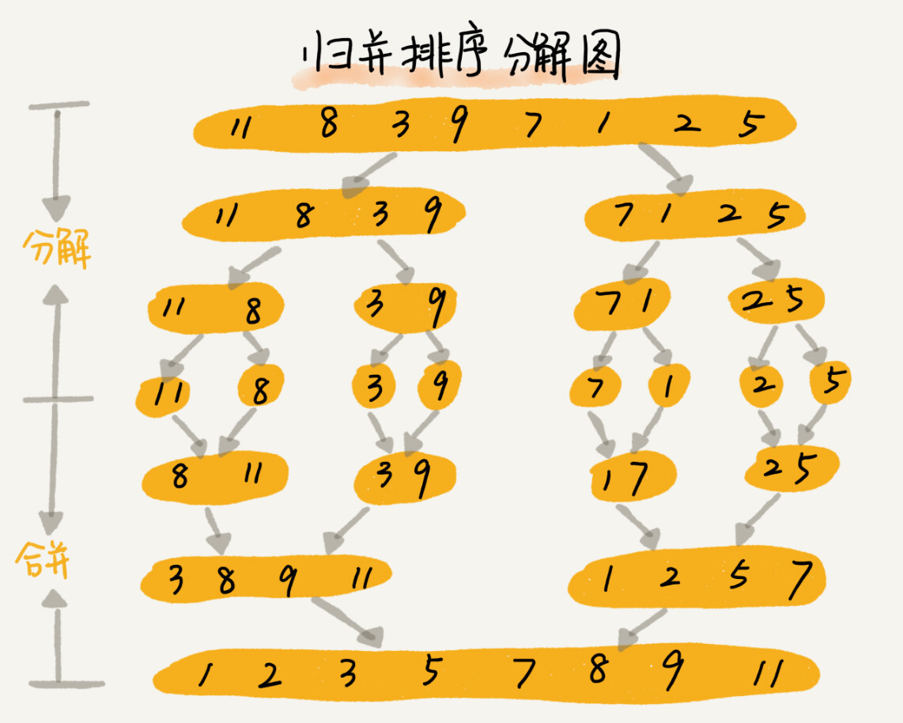
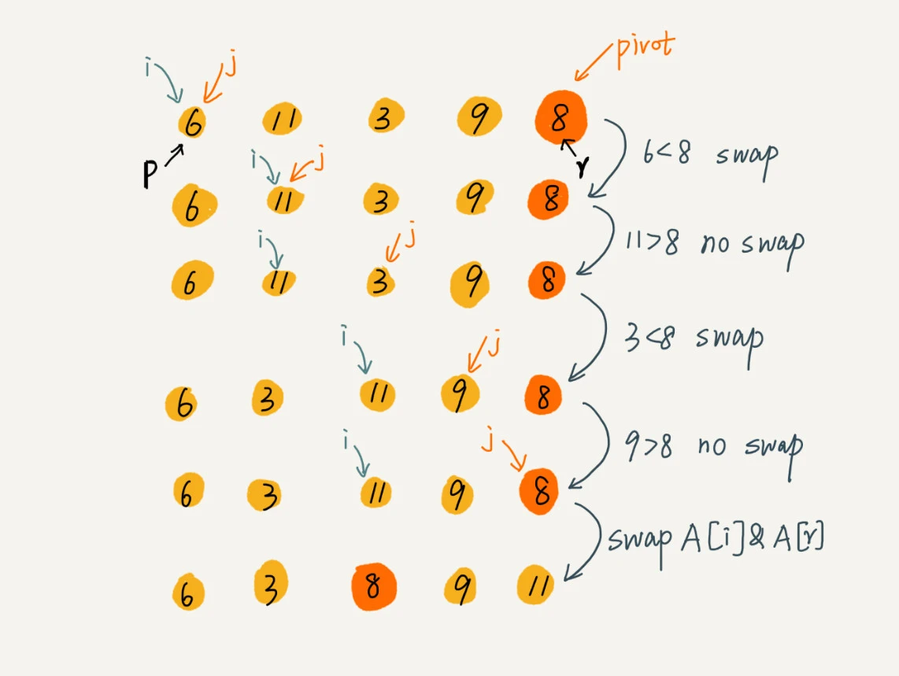

## 归并排序和快速排序总结

### 上节回顾

1. [堆排序和插入排序代码解读](https://juejin.cn/post/7018836879755706381)
2. [复杂度的分析和计算方法](https://juejin.cn/post/7018094312542076942)

### 基础知识回顾

1. **递归**：举个很简单的例子，你尝试着翻译一段英文，我们通常按照分句去翻译，然后我们发现这段英文有5-6个句子，一个句子中有几个不认识的单词，当你查询完单词的意思后，继续回到这个句子中进行整句的翻译，然后再将所有句子连起来，进行整段英文的翻译，这就是一个递归的过程
2. **递归需要满足的三个条件**
   * 一个问题的解可以分解为几个子问题的解
   * 这个问题与分解之后的子问题，除了数据规模不同，求解思路完全一样
   * 存在递归终止条件

### 归并排序（Merge Sort）

* #### **基本思想**

  如果要排序一个数组，我们先把数组从中间分成前后两个部分，然后对前后两部分分别排序，再将排好序的两部分合并在一起，这样整个数组就是有序的数组，它使用的其实是分治思想（将一个大问题分解成小的子问题来解决），小的问题解决了，大的问题也就解决了

* #### **动图展示**

  

  由上面的动图可以看出，一开始是两个元素开始比较，然后是4个，再然后是8个元素进行比较，这个方法和我们之前学习的递归有些相像，其实分治算法一般都是用递归来实现。

  分治是一种解决问题的处理思想，而递归是一种编程技巧

* #### **代码实现**

  ```javascript
  /**
   * 归并排序思想
   * 递归（分治）
   * @param {*} arr
   * @returns
   */
  const mergeSort = arr => {
    const len = arr.length;
    if (len <= 1) return arr;
    const middle = Math.floor(len / 2);
    const left = arr.slice(0, middle);
    const right = arr.slice(middle);
    return merge(mergeSort(left), mergeSort(right));
  };
  
  function merge(left, right) {
    let result = [];
    while (left.length && right.length) {
      if (left[0] < right[0]) {
        result.push(left.shift());
      } else {
        result.push(right.shift());
      }
    }
  
    if (left.length) {
      result = [...result, ...left];
    }
    if (right.length) {
      result = [...result, ...right];
    }
  
    return result;
  }
  ```

  

* #### **代码解读**

  首先我们记录下数组的长度，然后注意到当数组长度小于2的时候并不需要进行排序，可以直接返回数组，然后就是计算出左半边元素和右半边元素，进行**merge**操作，但是我们发现在**merge**函数中，我们传入的是左半边数组和右半边数组，并且是放在**mergeSort**方法中，形成递归

  我们看下面这张图来辅助解释

  

  不难看出，每一步的分解都是不断的将元素对半分，直至最后分解完只剩最后一个元素，也就是在分解到只剩最后一个元素的时候，才是这行代码起到的真正的作用**if (len <= 1) return arr**，所以我们可以按照这种分解的规律得到下面的推导过程

  第一步：merge(mergeSort([11, 8, 3, 9]), mergeSort([7, 1, 2, 5]))

  第二步：merge(merge(mergeSort([11, 8]), mergeSort([3, 9])), merge(mergeSort([7, 1]), mergeSort([2, 5])))

  第三步：merge(merge(merge(merSort([11]), mergeSort([8])), merge(mergeSort([3]), mergeSort([9]))), merge(merge(merSort([7]), mergeSort([1])), merge(merSort([2]), mergeSort([5]))))

  可能看起来比较视觉疲劳，但是这就是递归的精髓所在，当最内层的 mergeSort([11])里面传入的数组只有一个元素的时候，直接就可以return出去当前arr，交由次外层的`merge`方法进行排序，排序结束后又由次外层的`merge`继续对`merge`方法返回的数组进行合并排序，最终到最上层的`merge`，直接完成最后的左右两侧的合并排序完成数组元素排序

  那我们分析完之后，你知道`merge`方法需要实现什么功能吗？

  没错，两个数组的合并功能！而且是一直都是两个有序数组的合并功能，主要的思路就是依次比较两个数组的头部，小的先放入一个临时数组中，直到一个数组为空，直接将另一个数组中的元素插入临时数组的尾部，实现两个有序数组的排序

* #### **代码分析**

  * 空间复杂度分析

    我们看到，在将两个数组合并成一个数组的过程中，需要借助额外的存储空间，不难看出，我们将细化到每一个元素的时候，都需要申请一个临时数组来存放数组，比如上面一共对8个元素进行排序，一共执行`merge`方法7次，所以存储Jon关键随着数据规模的增长而增长，但是在递归的时间，还占用了O(logn)的栈空间，所以总的空间复杂度就是 O(n + logn)，因为量级的原因，所以最终的空间复杂度就是O(n)

  * 是否是稳定的排序算法

    是稳定的，主要取决于交换元素的时候是否会进行相同元素位置的互换，所以我们会看到`merge`方法，发现并不会进行元素的互换，但是我这里有个问题，因为我在处理剩余元素的时候，采用了es6的扩展运算符，这样会导致相同元素会被直接覆盖，所以如果排序期间有相同元素的情况，还是老老实实写一个while循环来处理

  * 时间复杂度分析

    我们假设对n个数据进行归并排序的时间是T(n)，那么分解成两个子数组的时间都是T(n/2)，然后`merge`函数的时间复杂度是O(n)，所以归并排序的时间复杂度的计算就是
    $$
    T(1) = C(C为一个常量)
    \\
    T(n) = 2 * T(n/2) + n; n >= 1
    $$
    上面的应该很好理解，n个元素进行归并排序可以分为2个n/2的元素的数组进行排序，最后将这两个数组进行merge排序
    $$
    T(n) = 2 * T(n/2) + n	
    \\	= 2 * (2 * T(n/4) + n/2) + n = 4 * T(n/4) + 2 * n
    \\  = 4 * (2 * T(n/8) + n/4) + 2 * n = 8 * T(n/8) + 3 * n
    \\  ......
    \\  = 2^k * T(n/2^k) + k * n
    \\  ......
    $$
    当T(n/2^k) = T(1)的时候，也就是k=log<sub>2</sub>n。我们将k带入上面的式子，可以得出T(n)=Cn + nlog<sub>2</sub>n，最后用大O表示法来表示就是O(nlogn)

    所以最终时间复杂度就是O(nlogn)

* ### **快速排序（Quick Sort）**

  * #### **基本思想**

    假设需要排序的是数组下标从p到r之间的一组数据，我们选择p到r之间的任意一个数据作为pivot（分区点），我们遍历p到r之间的数据，将小于pivot的放到左边，大于pivot的放在右边，将pivot放在中间，根据递归和分治的处理思想，我们可以递归进行元素的排序，直至最后区间缩小为1，就说明所有数据都是有序的了

  * #### **动图演示**

    

    这里我们看到图中选取的是第一个元素作为基准元素，也就是上面所说的分区点，然后是有两个指针指向当前数组的第一个元素，一个用来遍历剩下的元素，一个用来最后将第一个元素和当前指针所指向的元素进行互换，最后一轮遍历可以保证左侧元素都是小于第一个基准元素，右侧元素都是大于基准元素，然后再用这种方法进行递归
    
  * #### **代码实现**
  
    ```javascript
    function partition(arr, start, end) {
      // 以最后一个元素为基准
      const pivotValue = arr[end];
      let pivotIndex = start;
      for (let i = start; i < end; i++) {
        if (arr[i] < pivotValue) {
          // 交换元素
          [arr[i], arr[pivotIndex]] = [arr[pivotIndex], arr[i]];
          // 移动到下一个元素
          pivotIndex++;
        }
      }
    
      // 把基准值放在中间
      [arr[pivotIndex], arr[end]] = [arr[end], arr[pivotIndex]];
      return pivotIndex;
    }
    
    const quickSort = (arr, start, end) => {
      if (end <= start) {
        return;
      }
      let index = partition(arr, start, end);
      quickSort(arr, start, index - 1);
      quickSort(arr, index + 1, end);
      return arr;
    };
    ```
  
  * #### **代码解读**
  
    partition就是我们所说的分区操作，主要的功能就是将当前数组按照索引进行排序，通过传入start和end参数，选用最后一个元素（通过end获取）作为基准元素，然后从start开始遍历到end元素，如果比当前基准元素小，那么就将元素和`pivotIndex`进行交换，然后`pivotIndex`需要进行加一操作，循环结束之后，将基准元素和`pivotIndex`指向的元素进行互换，返回`pivotIndex`，此时`pivotIndex`左侧都是小于基准元素的，右侧都是大于基准元素的，通过不断的分化，直至每次进行分区操作的时候只剩2个或1个元素，才是真正的排序完成
  
    举个例子
  
    
  
    这里我们选取最后一个元素为基准元素，`i`和`j`都是指向的当前第一个元素，然后看配合上面的代码进行查看，因为6<8，所以需要进行交换，但是因为此时`i`和`j`都是指向的同一个元素，所以交换并无意义，所以这里只是起到了将`i`这个指针右移的目的，由于11大于8，不进行操作，然后当`j`来到3这个位置的时候，3<8，所以需要进行交换，也就是`i`和`j`当前指向的元素进行互换，然后再将`i`的指针右移一位，然后`j`右移发现9>8，不进行操作，然后当`j`来到8这个位置的时候，循环结束，将基准元素8和当前`i`指向的元素进行互换，完成一趟排序，此时基准元素左侧都是小于8的元素，基准元素右侧都是大于8的元素，这里的`i`就代表了`pivotIndex`，`j`就代表了上面循环中的`i`。
  
    然后这个时候`quickSort`函数中，`partition`函数是找了了一个基准元素，并将基准元素塞入数组中的正确位置并返回它所在的索引，然后我们需要做的就是递归遍历基准元素左右两侧的数组，所以再次调用`quickSort`方法，对基准元素左右两侧的数组进行排序，直到最后排序的`end - start <= 1`的时候，排序完成
  
  * #### **代码分析**
  
    * 空间复杂度分析
  
      从上面的代码我们可以看出来，在运行程序期间并不需要额外的存储空间，所以空间复杂度是 O(1)
  
    * 是否是稳定的排序算法
  
      不稳定，上面举例的图中，如果我们使用的是**6，8，7，6，3，5，9，4** 这串数字，那么经过第一次分区后，两个6的相对先后顺序就是改变
  
    * 时间复杂度分析
  
      因为也是采用的递归处理思想，所以每次分区正好能够将数组分成差不多大小的两个区间，那么快排的时间复杂度的计算和上面的归并排序其实是一样的，所以快速排序的时间复杂度也是O(nlogn)
  
      但是我们来想这么一个情况，一个已经有序的数组，如果我们每次选择最后一个元素作为基准元素，那么每次分区得到的两个区间都是不均等的，所以我们大概需要n次分区操作，才能完成整个快排的操作，这个时候，快排的时间复杂度就从O(nlogn)退化成了O(n<sup>2</sup>)，但是平均时间复杂度还是O(nlogn)

