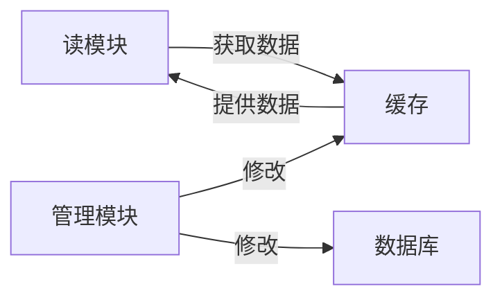
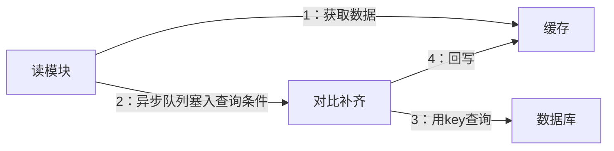

## 什么是全量缓存
指的是将数据库中的所有数据都存储在缓存中，同时在缓存中不设置过期时间

因为所有的数据都存放在缓存中，读服务在查询的时候不会降级到数据库中，所有的请求全部都依赖缓存。因此降级到数据库导致的**毛刺**问题得到了解决。

> 什么是毛刺？
> 命中缓存的请求一般在毫秒级返回数据，穿透到数据库的请求一般在秒级返回数据，从而会让用户体验到数据加载的差异。对于性能要求极高的APP首页等需要重视并解决。

但是全量缓存并没有解决更新时的分布式事务问题，显而易见，全量缓存对于数据的更新要求非常严格，需要保证数据库的已有数据和实时更新的数据必须完全同步至缓存中。

## 基于 Binlog 的全量缓存架构

### 什么是 Binlog
它是MYSQL及大部分主流数据库的主从数据同步方案。主数据库会将所有的变更按照一定的格式写入它本机的Binlog文件中，在主从同步时，从数据库会和主数据库建立连接，通过特定的协议串行读取主数据的Binlog文件，并在从库进行Binlog的回放，从而完成主从复制。

现在市面上有一些工具可以模拟主从复制的协议，相当于是Binlog的上层封装，可供大家使用接口获取数据。

将Binlog的中间件挂载到目标数据库上，可以实时获取到数据库的所有变更数据，对这些变更数据解析后可以直接写入缓存

### 采用了Binlog的同步方案的优点
* **降低了延迟**
* **解决了分布式事务的问题**
Binlog 的主从复制是基于ACK机制，如果同步缓存失败了，被消费的Binlog不会被确认，下一次会重复消费，数据最终会写入缓存中，保证了数据的最终一致性
* **提升了代码的简洁性和可维护性**

### 采用Binlog的缺点
* **提升了系统的整体复杂度**
* **缓存的容量会成倍上升，相应的资源成本也会上升**

### 如何优化
* 存储在缓存中的数据需要经过筛选，有业务意义的、会被查询的字段才进行缓存
* 存储在缓存中的数据可以进行压缩
* 基于Binlog的架构依然会有缓存丢失的问题，因为redis并没有类似数据库的ACID等功能
  为了解决这个问题，可以采用异步校准加报警及自动化补齐的方式来处理

当读服务查询缓存无数据后，会返回空给调用方，与此同时通过队列中间件发送一条消息，该消息的消费程序会异步查询数据库，如果数据库中有数据，则会进行一次告警或写入一条记录，并可以通过程序决定是否写入缓存。
* 为了提升性能和可用性，可以把数据写入缓存由一个集群变成多个集群，但是成本增加了。

### 一些市面上使用的Binlog中间件
* [databus](https://github.com/linkedin/databus)
* [canal](https://github.com/alibaba/canal)
